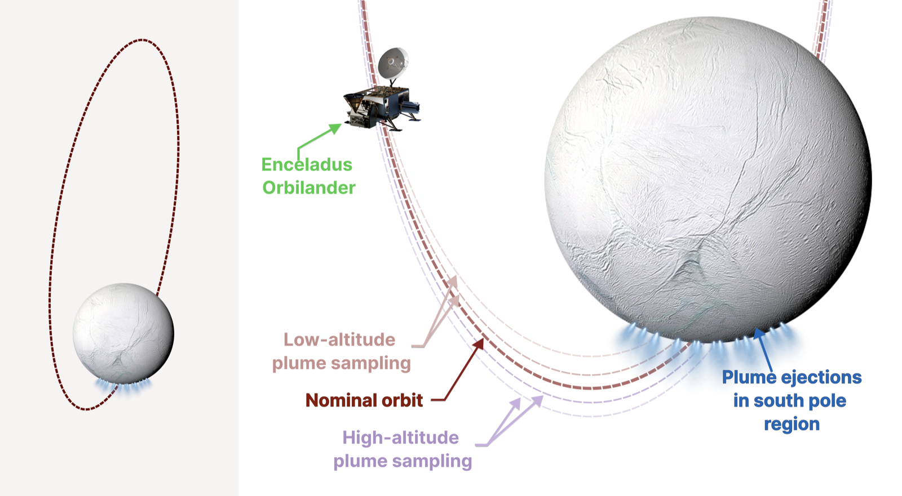

# SherpaOrbital.jl

SherpaOrbital.jl implements a POMDP for autonomous stationkeeping and plume-sampling decisions during the orbital phase of the Enceladus Orbilander mission concept (MacKenzie et al. 2020). The spacecraft repeatedly passes over Enceladus’s south-polar plumes, choosing between science excursions and maneuvers to maintain a recoverable orbit under uncertainty.



The spacecraft holds an unstable L1 halo orbit with periapsis over Enceladus's south pole,
so each revolution is both a plume-sampling opportunity and a stationkeeping decision.
Lower passes collect more concentrated plume material; they also leave the orbit harder to
recover. A POMDP chooses the maneuver objective for the next pass over a compact discrete
state, and an onboard targeting solver computes the continuous burn that realises it.

## Installation

```julia
using Pkg
Pkg.add(url = "https://github.com/gkim65/sherpa-orbital")
```

## Documentation

- **[GUIDE.md](GUIDE.md)** — the POMDP formulation, every configuration parameter, worked
  examples, the repository layout and the physics conventions.
- **[FIGURES.md](FIGURES.md)** — how to regenerate each figure from a sweep's checkpoints.

## Citation

TBD

## License

MIT — see [LICENSE](LICENSE).
